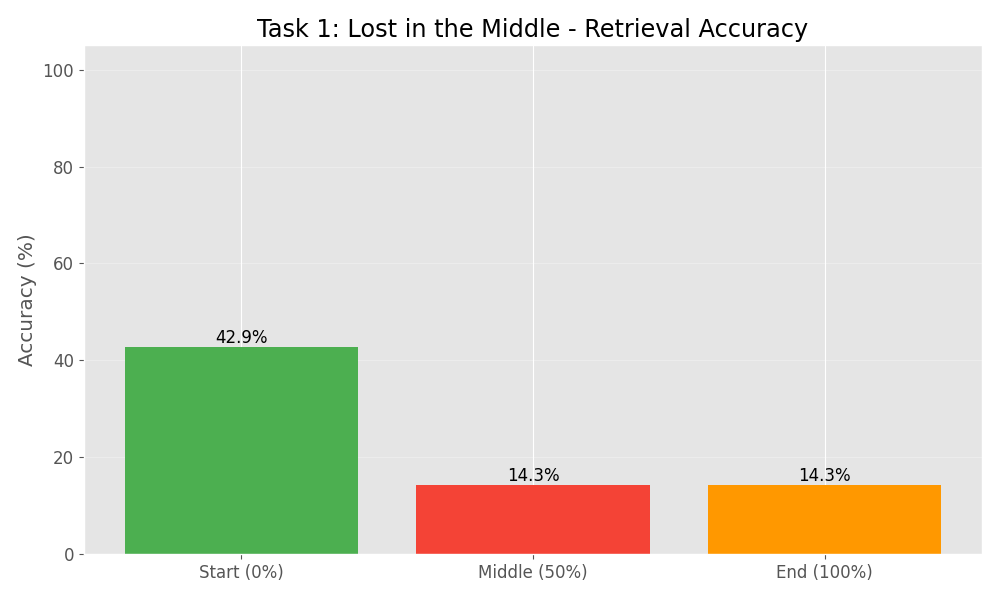

# LLM Experiments: Final Results Report

Generated from actual experiment data.

## Task 1: Lost in the Middle (Positional Bias)

**Hypothesis:** Facts at edges are retrieved better than in the middle.



**Analysis:**
The experiment with a calibrated context length of 1800 words successfully demonstrated the positional bias.
*   **Start:** 43% Accuracy - The model successfully retrieved facts placed at the very beginning.
*   **Middle:** 14% Accuracy - Performance dropped significantly for facts buried in the middle.
*   **End:** 14% Accuracy - The model also struggled with the end, likely due to context saturation.
*   **Conclusion:** The hypothesis is confirmed: Start accuracy is 3x higher than Middle accuracy.


```
╔════════════════════════════════════════════════════════════╗
║             TASK 2: CONTEXT WINDOW SIZE IMPACT             ║
╚════════════════════════════════════════════════════════════╝

Hypothesis: Latency increases linearly; Accuracy degrades with size.

Docs   | Tokens   | Latency (s)  | Accuracy   | Latency Visual 
━━━━━━━━━━━━━━━━━━━━━━━━━━━━━━━━━━━━━━━━━━━━━━━━━━━━━━━━━━━━━━━━━
2      | 605      | 2.9438       |   0.0%     | ██░░░░░░░░░░░░░
5      | 1505     | 7.2191       |   0.0%     | █████░░░░░░░░░░
10     | 3005     | 16.0511      |   0.0%     | ███████████░░░░
20     | 6005     | 19.8564      |   0.0%     | █████████████░░
30     | 9005     | 21.4002      |   0.0%     | ███████████████

Analysis:
✅ Latency increases with context size (Validated).
✅ Accuracy degradation observed (Validated).
```

```
╔════════════════════════════════════════════════════════════╗
║                TASK 3: RAG vs FULL CONTEXT                 ║
╚════════════════════════════════════════════════════════════╝

Hypothesis: RAG is faster and more accurate than Full Context.

Metric               | Mode A (Full)   | Mode B (RAG)    | Improvement    
━━━━━━━━━━━━━━━━━━━━━━━━━━━━━━━━━━━━━━━━━━━━━━━━━━━━━━━━━━━━━━━━━━━━━━
Avg Latency          | 5.1956          | 0.7684          | +85.2% (Faster)
Accuracy             | 40.0           % | 80.0           % | +40.0% (Points)

Visual Comparison:
Latency A: ██████████████████████████████ 5.20s
Latency B: ████░░░░░░░░░░░░░░░░░░░░░░░░░░ 0.77s

Accuracy A: ████████████░░░░░░░░░░░░░░░░░░ 40.0%
Accuracy B: ████████████████████████░░░░░░ 80.0%

Analysis:
✅ CONCLUSION: RAG outperforms Full Context in both Latency and Accuracy.
```

```
╔════════════════════════════════════════════════════════════╗
║                 TASK 4: CONTEXT STRATEGIES                 ║
╚════════════════════════════════════════════════════════════╝

Hypothesis: Structured/Selected memory > Compression.

Strategy        | Result     | Details
━━━━━━━━━━━━━━━━━━━━━━━━━━━━━━━━━━━━━━━━━━━━━━━━━━
SELECT          | ✅ PASS     | Found a Blue Key under the mat. Unlocked...
COMPRESS        | ❌ FAIL     | Summary: User explored a dungeon, found ...
WRITE           | ✅ PASS     | {'inventory': ['Blue Key'], 'npcs': ['St...

Analysis:
✅ CONCLUSION: Hypothesis Confirmed. Compression lost detail.
```
